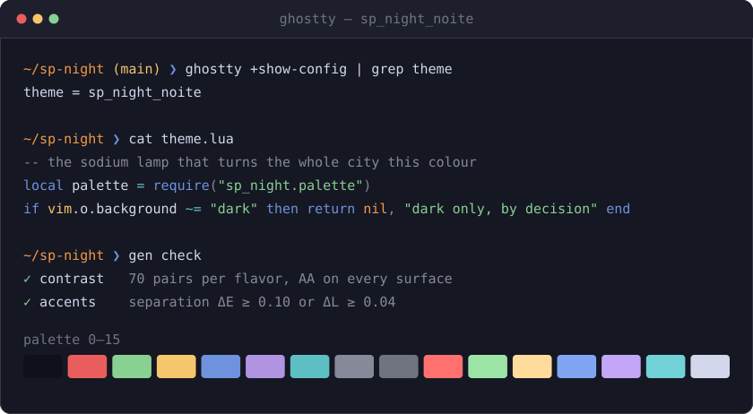
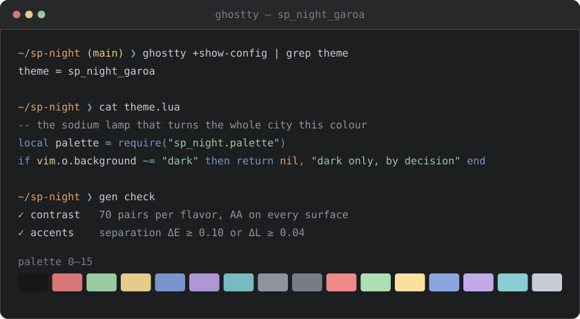
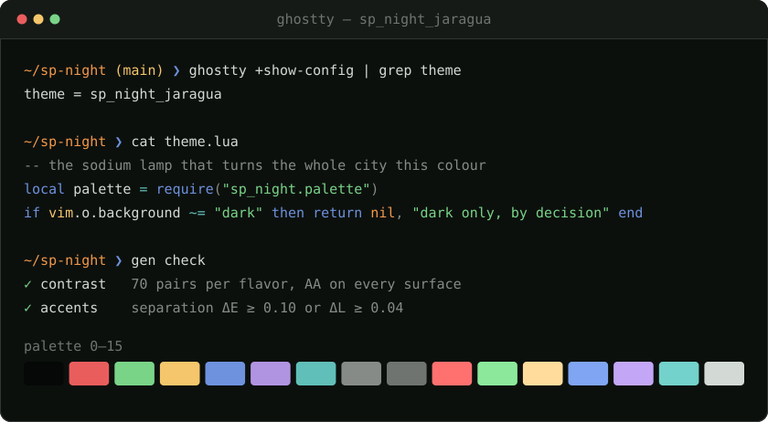

<p align="center">
  <a href="https://sp-night.github.io">
    
  </a>
</p>

<h1 align="center">SP Night for <a href="https://ghostty.org/">Ghostty</a></h1>

<p align="center">
  <strong>The sodium lamp turns the whole city this colour.</strong><br>
  A dark colour scheme with São Paulo as its reference — the sodium street lamp,<br>
  exposed concrete, the free span of the MASP, the drizzle before the rain.
</p>

<p align="center">
  <a href="https://sp-night.github.io"><strong>sp-night.github.io</strong></a>
  &nbsp;·&nbsp;
  <a href="https://sp-night.github.io/palette">palette</a>
  &nbsp;·&nbsp;
  <a href="https://sp-night.github.io/spec">spec</a>
  &nbsp;·&nbsp;
  <a href="https://sp-night.github.io/ports">ports</a>
</p>

---

## The flavours

All three are dark, by decision. The previews below are synthetic — drawn from the
palette itself, so they can never drift from what you install.

### Noite Paulista — `sp_night_noite`

The city at 3am. Blue-violet dark, the sodium lamp burning warm on top.



### Garoa — `sp_night_garoa`

The same window, seen through the drizzle. Flat grey — the garoa does not cool
the city down, it washes it out.



### Pico do Jaraguá — `sp_night_jaragua`

The same night, seen from the city's highest point. Near-black surfaces, with
the forest left to the accents — and the red-and-white tower lit at the summit.



## Install

Ghostty resolves `theme = <name>` against `~/.config/ghostty/themes/` by exact
file name — which is why the theme files deliberately have no extension.

Grab the flavour you want (or all three):

```sh
mkdir -p ~/.config/ghostty/themes
curl -Lo ~/.config/ghostty/themes/sp_night_noite \
  https://raw.githubusercontent.com/sp-night/ghostty/main/themes/sp_night_noite
```

Then enable it in `~/.config/ghostty/config`:

```ini
theme = sp_night_noite
```

Reload the configuration (`ctrl+shift+,` on Linux, `cmd+shift+,` on macOS) or
open a new window.

Prefer a checkout? Clone and copy — the files are plain text, there is no build:

```sh
git clone https://github.com/sp-night/ghostty.git
cp ghostty/themes/* ~/.config/ghostty/themes/
```

## What gets themed

| Ghostty key | Role | Meaning |
|---|---|---|
| `palette = 0…15` | `ansi.*` | the full 16-colour ANSI mapping |
| `background` / `foreground` | `ui.bg` / `ui.fg` | *laje* under the main text |
| `cursor-color` / `cursor-text` | `ui.cursor` / `ui.on_accent` | the *sódio* cursor, dark text inside it |
| `selection-background` / `-foreground` | `ui.selection` / `ui.fg` | *vidro*, glass reflecting the street |
| `split-divider-color` | `ui.border` | *fiação*, overhead wiring cutting the sky |
| `unfocused-split-fill` | `ui.bg_deep` | *vão*, the deepest recess |

No hex in this repo was picked by hand. Every value comes from the
[SP Night palette](https://sp-night.github.io/palette) through its role layer,
both published as data:
[`palette.json`](https://sp-night.github.io/palette.json) and
[`roles.json`](https://sp-night.github.io/roles.json). The contrast floors those
colours have to clear are [written down in the spec](https://sp-night.github.io/spec)
and enforced in CI.

## The mapping

[`ghostty.tmpl`](ghostty.tmpl) is the full record of which Ghostty key means which
role — the table above in complete form. The files in
[`themes/`](themes) are what it resolves to, one per flavour.

You never need it to use the theme: the shipped files are plain text and final.
It is here so the mapping survives, and so a retuned palette can be rolled
through this port without anyone re-deciding what `cursor-color` means.

## License

[MIT](LICENSE)
